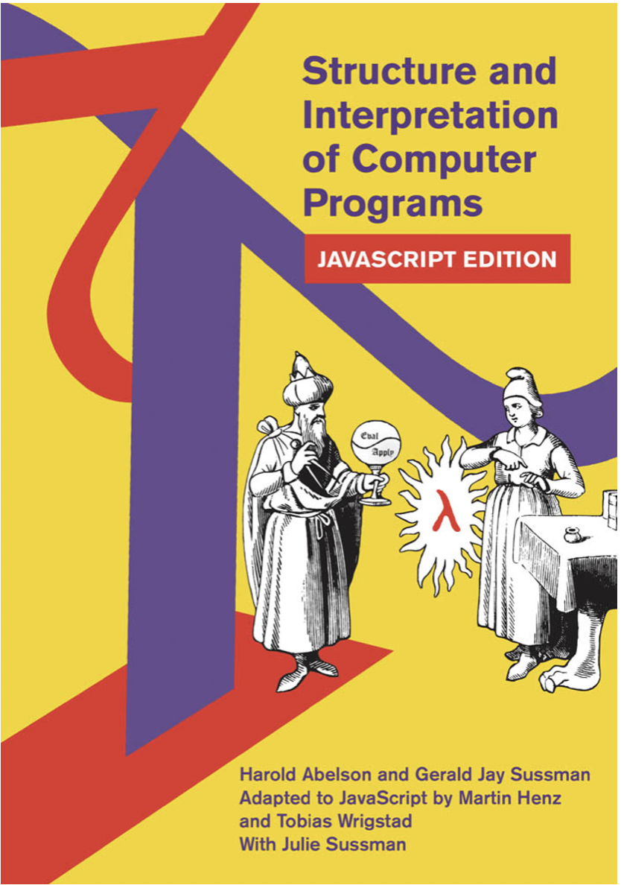

# sicp-portuguese
Tradução do Livro "Structure and Interpretation of Computer Programs - JavaScript Edition"

## Objetivo

Fazer a tradução do livro na versão que utiliza o _JavaScript_ no lugar do _Scheme_ para o português brasileiro. Será uma tradução informal, para poder adotá-lo em sala de aula e também aprender seu conteúdo.
